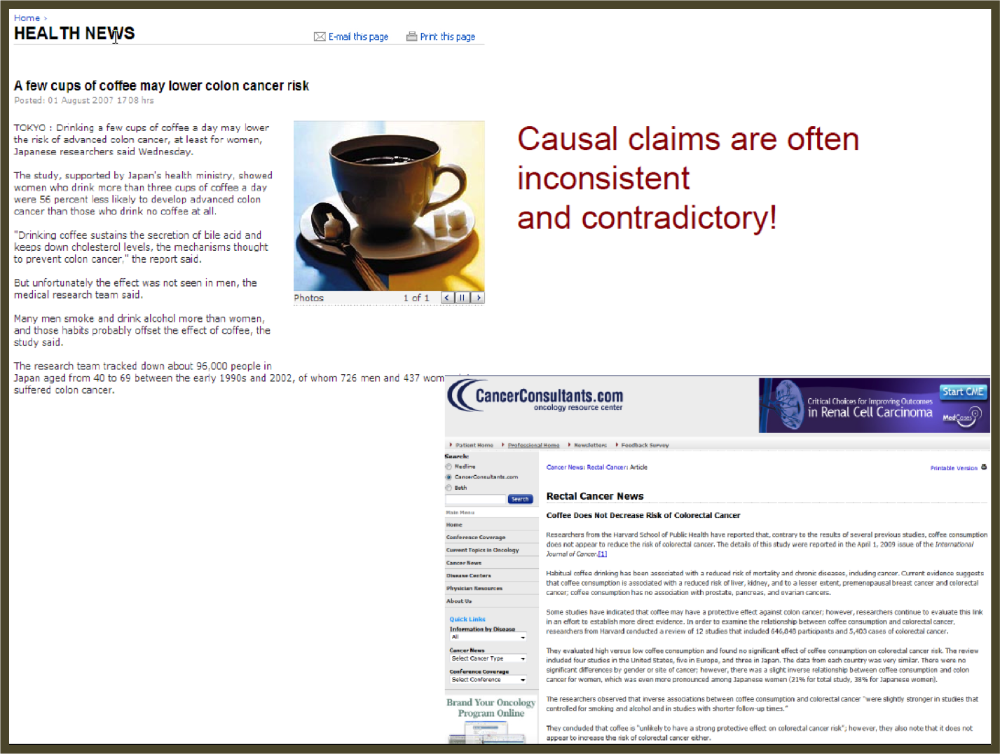
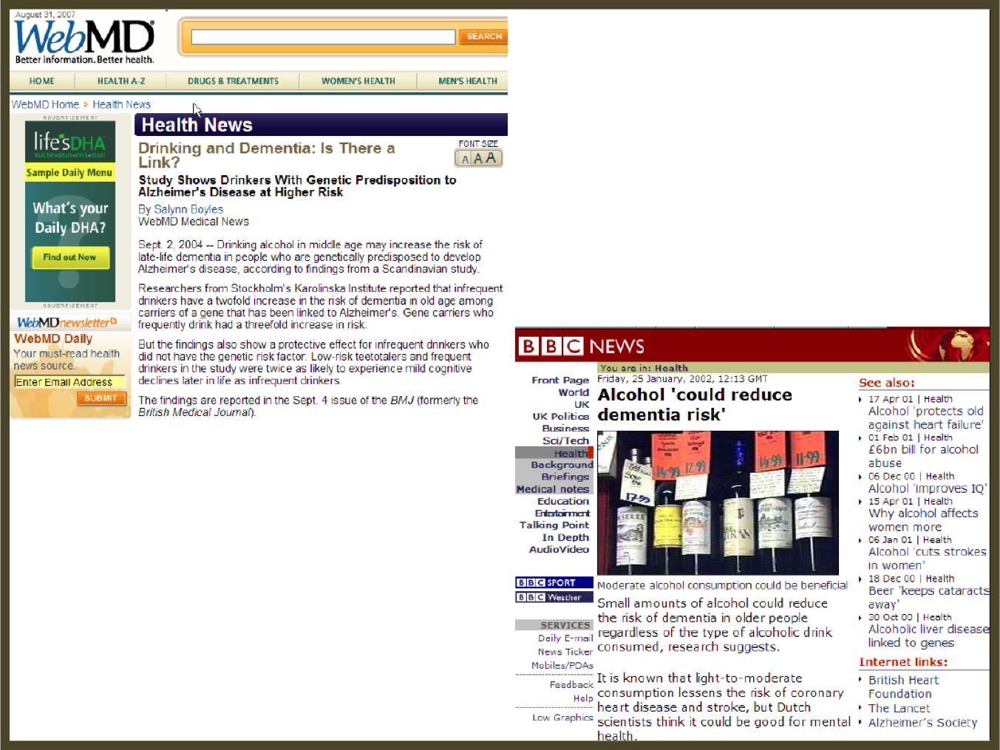
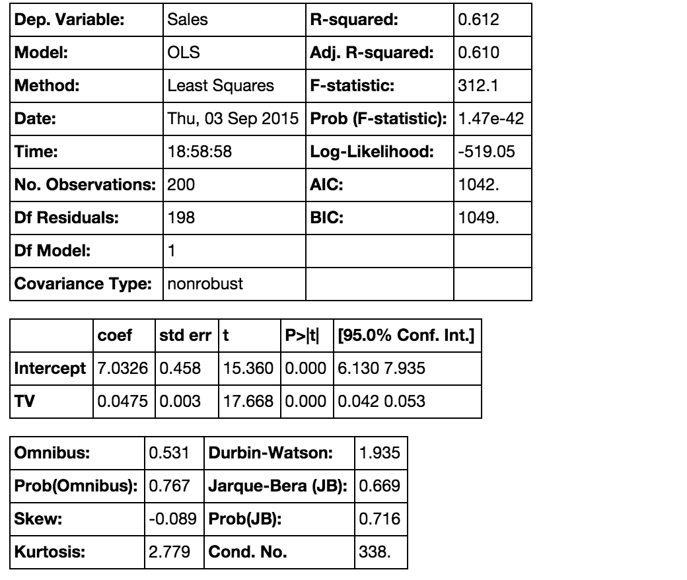

#  Statistics Review
DS | Lesson 4

### LEARNING OBJECTIVES
*After this lesson, you will be able to:*

- Explain the difference between causation vs. correlation
- Test a hypothesis within a sample case study
- Validate your findings using statistical analysis (p-values, confidence intervals)

### STUDENT PRE-WORK
*Before this lesson, you should already be able to:*

- Explain the difference between variance and bias  
- Use descriptive stats to understand your data

### LESSON GUIDE

| TIMING  | TYPE  | TOPIC  |
|:-:|---|---|
| 5 min  | [Opening](#opening)  | Lesson Objectives  |
| 5 min  | [Introduction](#introduction1)   | Causation and Correlation |
| 25 min  | [Lecture](#lecture1)  | Causality vs Correlation |
| 15 min  | [Guided Practice](#guided-practice)  | Confounding and DAGs |
| 5 min  | [Introduction](#introduction2)   | Hypothesis Testing |
| 30 min  | [Demo](#demo)   | Hypothesis Testing: Case Study |
| 5 min  | [Introduction](#introduction3) | Validate your findings |
| 20 min  | [Demo](#demo2)  | P-values, CI: Case Study|
| 35 min  | [Independent Practice](#independent-practice)  | Practice with p-values and CI|
| 15 min  | [Wrap-up](#wrapup)  | Review Guided Practice|

---

## Opening (5 min)
session
- Discuss Current Lesson Objectives
- Review prior exit tickets

#### Data Source
Today we will use advertising data from an example in
[An Introduction to Statistical Learning by Gareth James](http://www-bcf.usc.edu/~gareth/ISL/Advertising.csv).

## Intro: Causation and Correlation (5 mins)
If an association is observed, the first question to ask should always be… is it real?

Just think of all the times you've seen press about foods being good for you then being terrible for you.

Why is this? The first reason might simply be sensational headlines. But the other issue is the neglecting robust data analysis and lacking an understanding of the difference between *causation* and *correlation*.

Understanding these differences is critical, especially at the beginning of the data science workflow, while **Identifying** and **Acquiring** data.

We need to make sure that we fully articulate our question and use the right data to answer it, including any potential *confounders*.

Additionally, this topic comes up again during the final step in our data science workflow, when we **Present** our results to stakeholders.

It's important that we communicate our findings in a way that doesn't overstate what our model actually measures. For example, be careful not to say "caused" when you really mean "measured" or "associated".

## Intro: Causation vs Correlation (10 min)

#### Causal Criteria
Causal criteria is one approach to assessing causal relationships, but it's very hard (nearly impossible!) to define universal *causal* criteria.

One such attempt that is commonly used in the medical/health sciences fields is based on work by Bradford Hill. He developed a list of "tests" that an analysis much pass in order to indicate a causal relationship. These requirements include:

1. Strength of association
2. Consistency
3. Specificity
4. Temporality
5. Biological gradient
6. Plausibility
7. Coherence
8. Experiment
9. Analogy

This is by no means an exhaustive checklist, but it's useful for understanding that your predictor/exposure **must have occurred before your outcome**. For example, in order for smoking to cause cancer, one must have started smoking prior to getting cancer.

Most commonly we find an association between two variables. This means that we observe a **correlation** between our variables.

However, we may not fully understand the causal direction or how other factors may be influencing the association we are observing.

**Check:** What is the difference between causation and association?

## Guided Practice: Confounding and DAGs (15 min)

#### Confounding
Often times, the observation that we observe may be influenced by another *confounding* factor.

Let's say we did an analysis to understand what causes lung cancer. We find a strong association between carrying cigarette lighters and lung cancer.

In fact, people who carry cigarette lighters are 2.4 times as likely to contract lung cancer as people who don’t carry lighters. However, does this mean that the lighters are causing lung cancer? No.

**Check:** What factor(s) are missing from this model? How might we measure for these?

A *DAG- Directed Acyclic Diagram* is a handy tool to help you determine which variables are most important for your model.

A DAG always includes at least one exposure/predictor and one outcome. For example:

Here the exposure/predictor is TV ads and it is associated with an outcome, sales. We can measure the strength to demonstrate a strong association between tv ads and sales.

What other factors may increase sales? What other types of ads? Creating a DAG might then look something like:

`TV Ads --> Sales <-- Google Ads`

### Think, Pair, Share
Let's say we want to evaluate which type of ad is associated with higher sales.

Great- let's take a look at the association between TV Ads and Sales by taking into account *seasonality*.

On a DAG this would look something like a triangle between:  
`TV--> Sales and seasonality --> TV Ads and seasonality --> Sales`

Let's assume that the TV ads were run in November/December (right before holiday gift season) while the Google ads were run during February & March (when sales are historically low).

If we compare TV and Google Ads but don't take into account seasonality, then we are likely to make the wrong conclusion. In this case, we might assume that Google ads are not as effective at driving sales as tv ads, but this would be an example of *bias* and *confounding*.

**Check:** What is bias and confounding? What could we do differently in this example to avoid these elements?

#### Real World Application
This example highlights a few key takeaways:

1) The importance of having deep subject area knowledge. You'll develop this over time and it will help you move through your analysis in a logical manner. However, keep in mind that you can show a strong association and still be totally wrong.

2) That a DAG (directed acyclic graph) can be a handy tool for thinking through the logic of your models.

3) The distinction between causation and correlation. In our smoking example, it's relatively obvious that there's a flaw in our logic; however, this won't always be so readily apparent... especially in cutting edge fields where there are many other unknown variables.

4) The importance of good data. Throughout the class we will be working on helping you develop your data intuition, so that you can spot gaps and bias more readily. With this will come a bunch of tools to help you. However, your analysis is only as good as your understanding of the problem and the data.

## Intro: Hypothesis Testing (5 mins)

You'll remember from last time that we worked on descriptive statistics. How would we tell if there is a difference between our groups? How would we know if this difference was real or if our finding is simply due to chance?

These are the questions we often tackle when we are building out our models in the Refine & Build steps of our data science workflow.

For example, if we are working on sales data, how would we know if there was a difference between the buying patterns of men and women at Acme Inc? Hypothesis testing!

#### Hypothesis testing steps
Generally speaking, you start with a null hypothesis and an alternative hypothesis, which is opposite the null. Then, you check whether the data supports rejecting your null hypothesis or failing to reject the null hypothesis.

Note that "failing to reject" the null is ***not*** the same as "accepting" the null hypothesis. Your alternative hypothesis may indeed be true, but you don't necessarily have enough data to show that yet.

This distinction is important to help you avoid overstating your findings. You should only state what your data and analysis can truly represent.

Here is an example of a conventional hypothesis test:

- Null hypothesis: There is no relationship between Gender and Sales.
- Alternative hypothesis: There is a relationship between gender and Sales

Let's dive into this more with the demo.

## Demo: Hypothesis Testing Case Study (30 mins)

**Check:** What is the null hypothesis? Why is this important to use?

## Intro: Validate your findings (5 mins)
How do we tell if the association we observed is *statistically significant*?

*Statistical Significance* is the likelihood that a result or relationship is caused by something other than mere random chance. Statistical hypothesis testing is traditionally employed to determine if a result is statistically significant or not.

Typically, we use a cut point of 5%. In other words, we say that something is NOT statistically significant if there is a less than 5% chance that our finding was due to chance alone.

When data scientists present results and say we found a significant result- it is almost always using these criteria. Let's dive into them further to understand p-values and confidence intervals.

## Demo: P-values & CI in the case study (20 mins)

**Check:** What does a 95% confidence interval indicate?

## Independent Practice (35 min)
For this exercise, you will look through a variety of analyses and interpret the findings.

You will be presented a series of outputs (similar to the ones we will generate once we start regression) and tables from a published analysis.

For this lab you will be asked to read these outputs and tables and determine if the findings are statically significant or not.

You will also get practice looking at the output and understanding how the model was built (e.g. identifying predictor/exposure vs outcome).

## Conclusion: Questions (15 mins)

Any questions?

***

### BEFORE NEXT CLASS
|   |   |
|---|---|
| **UPCOMING PROJECTS**  | [Unit Project 2](../../projects/unit-projects/project-2/readme.md)  |

